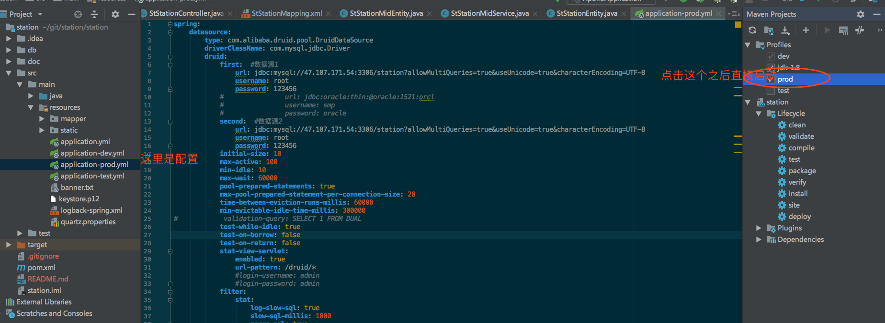

# Introduction to apollo 

是一个前后端分离的一个架构，始于药监的一个数据中心的项目

## What is apollo
- apollo是一个轻量级的，前后端分离的Java快速开发平台
- 支持MySQL、Oracle 数据库

**具有如下特点** 
- 友好的代码结构及注释，便于阅读及二次开发
- 实现前后端分离，通过token进行数据交互，前端再也不用关注后端技术
- 灵活的权限控制，可控制到页面或按钮，满足绝大部分的权限需求
- 页面交互使用Vue2.x，极大的提高了开发效率
- 完善的代码生成机制，可在线生成entity、xml、dao、service、vue、sql代码，
- 引入quartz定时任务，可动态完成任务的添加、修改、删除、暂停、恢复及日志查看等功能
- 引入API模板，根据token作为登录令牌，放在redis里面极大的方便了APP接口开发
- 敏感数据RSA加密传输
- 前后端分离，通过token进行数据交互，可独立部署
- 动态菜单，通过菜单管理统一管理访问路由

## How does it work

**后端项目结构** 
```
Apollo
├─db  项目SQL语句
│
├─doc  项目脚本语句
├─common 公共模块
│  ├─annotation 自定义的一些@ 标签
│  ├─aspect 系统日志
│  ├─entity abstract 实体类
│  ├─factory 工厂方法
│  ├─exception 异常处理
│  ├─utils 工具类
│  ├─validator 后台校验
│  └─xss XSS过滤
│ 
├─config 配置信息
│ 
├─datasources 多数据源设置
│ 
├─properties 配置文件属性设置
│ 
├─modules 功能模块
│  ├─app API接口模块(APP调用)
│  ├─job 定时任务模块
│  ├─kettle 数据模块
│  ├─oss 文件服务模块
│  └─sys 权限模块
│ 
├─ApolloApplication 项目启动类
│  
├──resources 
│  ├─mapper SQL对应的XML文件
│  ├─static 静态资源
│  └─template 代码生成的模板

```
<br> 

**前端项目结构** 
```
Apollo-vue
├─build  webpack设置文件
├─bash  项目脚本语句
├─node_modules  node js 模块
├─components 组件
│  ├─icon-svg  图标  对应iconfont https://www.iconfont.cn/
│  └─table-tree-column 树结构
│ 
├─utils 工具类js
│ 
├─router 路由设置
│ 
├─icons 图标设置
│ 
├─views 功能模块
│  ├─common 公共页面
│  ├─modules 权限模块
│  │  ├─job  定时任务页面  对应iconfont https://www.iconfont.cn/
│  │  └─sys 系统管理页面

├─gulpfile.js 打包文件
│  
├─.editorconfig 前端代码规范
├─.package.json npm包内容，已经命令
```
<br> 

## 快速启动

1、下载例子代码从[部门的Git网址](http://114.67.22.75:10101/)
<br>
<div align="center">
    
</div> 
这截图的两个项目中没有权限，联系张恒

2、后端导入到idea中，然后环境变量改为prod
<br>
<div align="center">
    
</div> 


3、将前端项目导入WebStorm之中

- 安装[WebStorm](https://www.jetbrains.com/webstorm/)
- 安装nodeJS [nodejs官网](https://nodejs.org/en/download/)
- 安装阿里镜像  npm install -g cnpm --registry=` https://registry.npm.taobao.org `  [参考](http://npm.taobao.org/)
- 在项目目录中运行 cnpm install 
- 启动项目  npm run dev 


