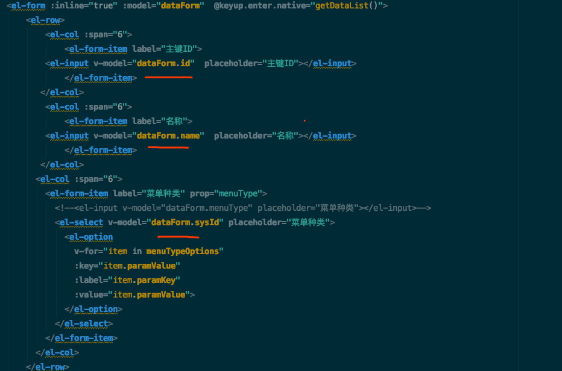
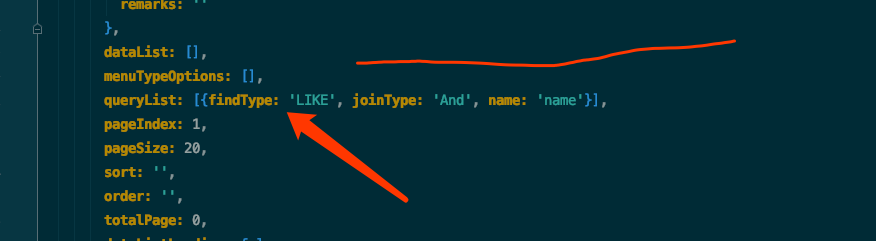

# 超快的查询方法
这个是来源于广交会里的设计，源代码读了一遍，然后结合本身的项目进行优化，在他的版本上进行进一步升级

## 使用方法
- 选取需要的查询语句，比如图中的参数
<div align="center">
    
</div> 

- 根据需要改变查询的方式eq... like等等，默认是eq(等于)
<div align="center">
    
</div> 

可以参考的地方是 com.bingo.common.param.enums.EFindType 这个类
``` java 
    EQ("1", "等于"),
    NOT_EQ("2", "不等于"),
    GT("3", "大于"),
    GTE("4", "大于等于"),
    LT("5", "小于"),
    LTE("6", "小于等于"),
    LIKE("7", "匹配"),
    NOT_LIKE("8", "不匹配"),
    BETWEEN("9", "范围"),
    IN("10", "包含"),
    NOT_IN("11", "不包含"),
    IS_NULL("12", "为空"),
    IS_NOT_NULL("13", "不为空");
```

- 修改粟子
比如要用大于或者等于的时候 就选取GTE 在代码里queryList 数组中添加一个对象
``` javascript 
   queryList: [{findType: 'LIKE', joinType: 'And', name: 'paramValue'},{findType: 'LIKE', joinType: 'And', name: 'paramKey'},{findType: 'GTE', joinType: 'And', name: 'label'}],
```

## 原理

- 以后补充


