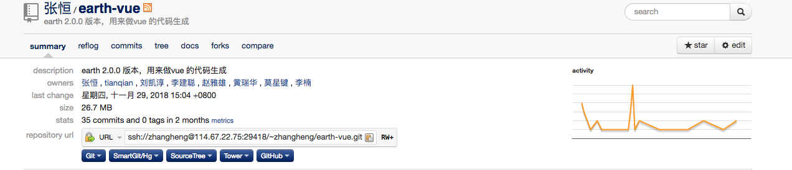
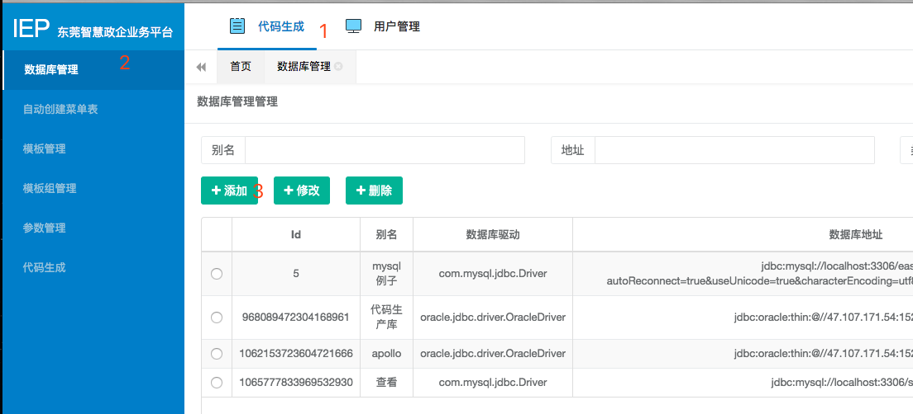
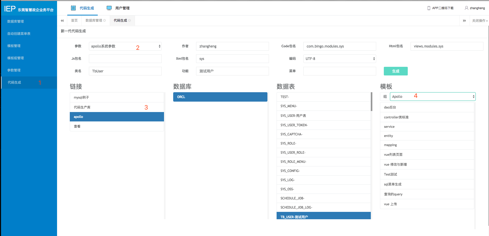

# 代码生成
代码生成器是作为效率工具的存在，而且代码生成器不受项目的限制，不受数据库的限制

## 代码生成器地址
代码生成器一个springboot项目写的，作为一个单独的存在独立出来  [Git地址](http://114.67.22.75:10101/)
 

    

 

## 代码生成器使用

1、  打开代码生成网页[代码生成](http://47.107.185.156:8078/login),不用密码输入直接使用默认密码进入系统之中
如果代码生成器项目是部署在外网的话，确保这个代码生成器外网也是可以访问的。

    

 

- 点击数据库配置
- 点击添加
- 添加相关配置

2、打开代码生成的网页直接生成代码

    

 

- 填参数 js 生成路径等等
- 点击那个数据库
- 点击需要选择的表
- 点击要生成的模板

> 注意模板上面的 Test类要放到test的文件夹下面，作为测试，上传也要做一些修改。模板可以随时改，但是这里就不提了。

